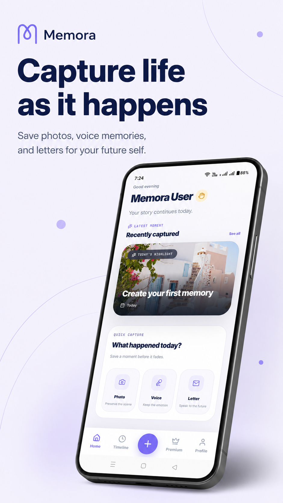
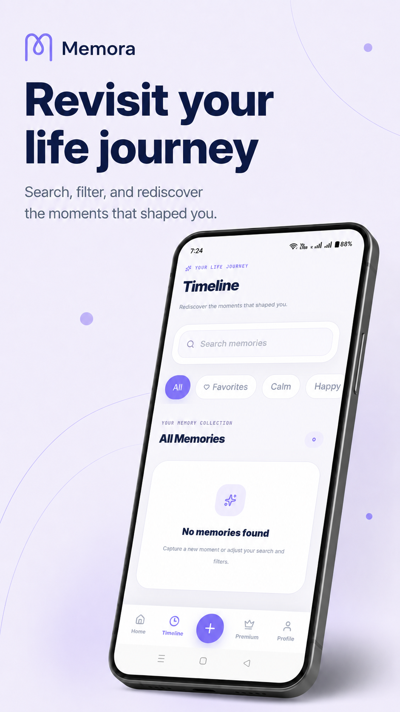
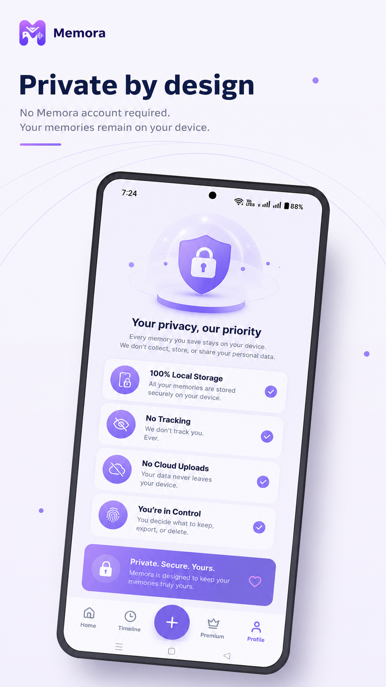
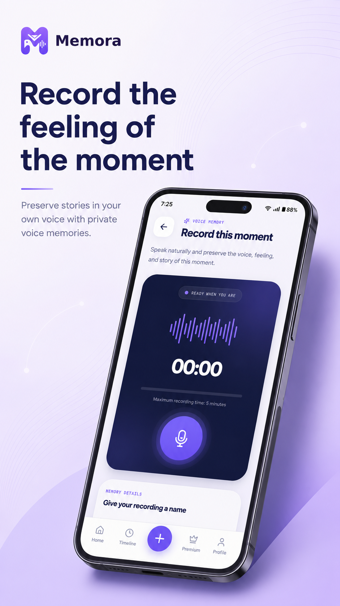
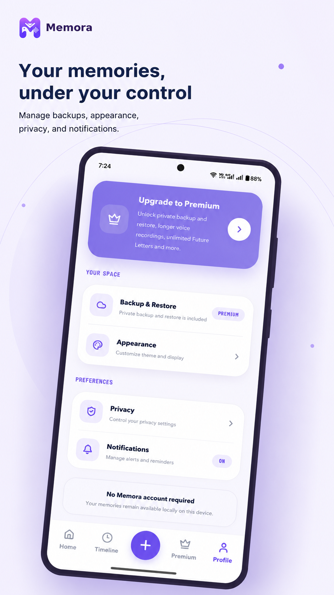
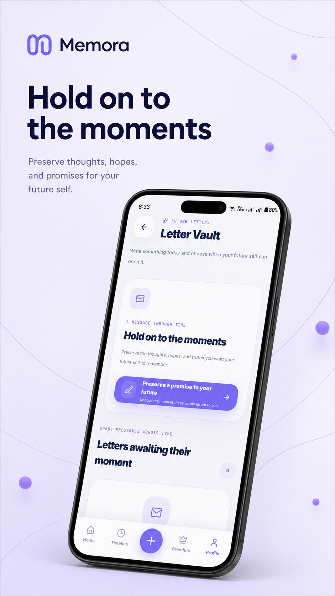

<div align="center">

# 👋 Hey, I'm **Vinoth Kumar**

### 🚀 FinTech Professional · Developer · Product Builder

<a href="https://github.com/Vinoth1412">
  
</a>

<br/><br/>

<a href="YOUR_PORTFOLIO_URL">
  
</a>

<a href="https://www.linkedin.com/in/vinoth-kumar-a405aa329">
  
</a>

</div>

<br/>

<div align="center">


</div>

---

# 🧑‍💻 About Me

I'm a **Banking & FinTech professional** with experience across **merchant onboarding, payment operations, KYC/eKYC, AML, banking partnerships, investment banking and capital markets operations**.

Alongside my professional career, I build software products and explore **AI, automation, mobile development and modern web technologies**.

I enjoy taking an idea from:

```text
💡 Idea
   ↓
🎯 Problem
   ↓
🎨 Product Design
   ↓
🏗️ Architecture
   ↓
💻 Development
   ↓
🧪 Testing
   ↓
🚀 Launch
   ↓
📈 Improve
```

> **I don't just want to write code — I want to build products people actually use.**

---

# ⚡ What I Do

<table>
<tr>
<td width="50%">

### 🏦 FinTech & Banking

* Merchant onboarding
* Payment operations
* Banking partnerships
* KYC / eKYC
* AML & compliance operations
* Bank account verification
* Payment gateway workflows
* VPA / account mapping
* Investment banking operations
* Capital markets operations

</td>

<td width="50%">

### 💻 Technology & Product

* Web application development
* Android application development
* UI / UX implementation
* Product architecture
* AI-powered applications
* Automation workflows
* API integrations
* Product development
* Product launch & deployment

</td>
</tr>
</table>

---

# 🛠️ Tech Stack

### 💻 Development

<p>

</p>

### 📱 Mobile Development

<p>

</p>

### 🗄️ Data & Tools

<p>

</p>

### 🎨 Design

<p>

</p>

---

# 🚀 Featured Product

<div align="center">

# 🧠 Memora

### *Your memories. Your story. Your life.*

</div>

**Memora** is a mobile-first personal memory platform designed to help people preserve meaningful moments through **memories, photos, stories, voice recordings, timelines and future letters**.

Memora is built around a **privacy-first, local-first philosophy**, keeping user-created personal content on the device while using cloud services selectively for authentication and premium capabilities.

---

## ✨ What Memora Offers

<table>
<tr>
<td align="center" width="25%">

### 📸

**Memories**

Capture and preserve meaningful moments.

</td>

<td align="center" width="25%">

### 🎙️

**Voice**

Record personal voice memories.

</td>

<td align="center" width="25%">

### 🗓️

**Timeline**

Experience memories chronologically.

</td>

<td align="center" width="25%">

### ❤️

**Favorites**

Keep the moments that matter most.

</td>
</tr>

<tr>
<td align="center">

### 📝

**Stories**

Turn moments into personal stories.

</td>

<td align="center">

### 😊

**Moods**

Capture the emotion behind memories.

</td>

<td align="center">

### ✉️

**Future Letters**

Write messages for the future.

</td>

<td align="center">

### 📖

**Memory Book**

Create beautiful memory collections.

</td>
</tr>
</table>

---

# 🔐 Privacy-First Architecture

Memora follows a **local-first storage approach**.

```text
                    MEMORA
                       │
              ┌────────┴────────┐
              │                 │
        Personal Data       Cloud Services
              │                 │
              ▼                 ▼
       📱 Local Device      🔐 Authentication
              │                 │
              ├── Memories      └── Premium
              ├── Photos            Entitlement
              ├── Voice
              ├── Timeline
              ├── Stories
              └── Future Letters
```

### 🔒 Personal content stays local

* Memories
* Photos
* Voice recordings
* Stories
* Timeline information
* Moods
* Tags
* Future Letters

Premium capabilities can later include **Google Drive backup and restore using the user's own Google Drive**.

---

# 🧰 Memora Technology

<div align="center">


<br/><br/>


</div>

---

## 🧠 Memora

<p align="center">
  <strong>Your memories. Your story. Your life.</strong>
</p>

<p align="center">
  A privacy-first, local-first mobile application designed to preserve
  meaningful moments, photos, stories, voice memories and future letters.
</p>

<p align="center">
  <a href="https://play.google.com/store/apps/details?id=com.lee.memora">
    
  </a>
</p>

<br/>

### ✨ Memora Preview

<p align="center">
  
  
  
</p>

<p align="center">
  
  
  
</p>

---

# 🏦 Professional Experience

## Senior Banking Alliance Executive

### Banking · FinTech · Payments

My professional experience includes working across banking and financial technology operations, with a strong focus on business processes, partner coordination and regulated financial workflows.

### Core Experience

```text
Merchant Onboarding
        ↓
Document Verification
        ↓
KYC / eKYC
        ↓
Bank Verification
        ↓
Payment Gateway Operations
        ↓
VPA / Account Mapping
        ↓
Transaction Operations
        ↓
Compliance & Monitoring
```

### Key Areas

* 🏦 Merchant onboarding for e-commerce businesses
* 💳 Payment gateway operations
* 🤝 Banking partner coordination
* 🔐 KYC / eKYC processes
* 🛡️ AML and compliance workflows
* 🏦 Bank account verification
* 💰 VPA / account mapping
* 📄 Merchant documentation
* 📈 Transaction operations
* 🤝 Banking alliance management
* 💼 Investment banking operations
* 📊 Capital markets operations
* 📑 IPOs
* 📑 Rights issues
* 🔄 Buybacks
* 🏢 Corporate actions
* 👥 Stakeholder coordination

---

# 🧠 Business + Technology

One of my biggest strengths is combining **financial-domain knowledge with technology and product thinking**.

```text
                 REAL-WORLD PROBLEM
                         │
                         ▼
                  BUSINESS LOGIC
                         │
                         ▼
                    PRODUCT IDEA
                         │
                         ▼
                    UI / UX
                         │
                         ▼
                   TECHNOLOGY
                         │
                         ▼
                  WORKING PRODUCT
```

> **Business knowledge helps me understand the problem.
> Technology helps me build the solution.**

---

# 🎯 What I'm Building Toward

I'm interested in building products around:

* 🤖 Artificial Intelligence
* 🏦 FinTech
* 💳 Payment Technology
* 📱 Mobile Applications
* 🌐 Modern Web Applications
* ⚙️ Automation
* 🧠 AI-powered productivity
* 🚀 Consumer applications
* 🔐 Privacy-first technology

---

# 🌱 Always Learning

```text
AI Engineering
      ↓
AI-powered Products
      ↓
Advanced React & TypeScript
      ↓
Mobile Architecture
      ↓
Automation & APIs
      ↓
Scalable Product Engineering
```

---

# 🤝 Let's Connect

<div align="center">

<a href="https://www.linkedin.com/in/vinoth-kumar-a405aa329">

</a>

<a href="YOUR_PORTFOLIO_URL">

</a>

<a href="https://github.com/Vinoth1412">

</a>

</div>

---

<div align="center">

### 🚀 Build. Automate. Solve. Ship.

**Thanks for visiting my profile!**

⭐ *Feel free to explore my work and follow my journey.*

</div>
